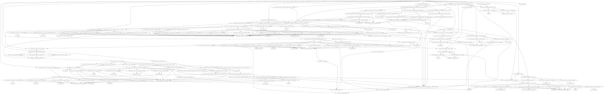

<!-- BEGIN_TF_DOCS -->
## About
This is educational task for provisioning wordpress infrastructure on Google Cloud Provider
## Scheme

## Requirements
No requirements.
## Providers

| Name | Version |
|------|---------|
|  [local](#provider\_local) | 2.2.3 |

## Modules

| Name | Source | Version |
|------|--------|---------|
|  [cloud-sql](#module\_cloud-sql) | ./modules/cloud_sql | n/a |
|  [cloud-storage](#module\_cloud-storage) | ./modules/cloud_storage | n/a |
|  [firewall](#module\_firewall) | ./modules/firewall | n/a |
|  [instance-group](#module\_instance-group) | ./modules/instance-group | n/a |
|  [packer](#module\_packer) | ./modules/packer | n/a |
|  [secret-manager](#module\_secret-manager) | ./modules/secret-manager | n/a |
|  [service-account](#module\_service-account) | ./modules/service-account | n/a |
|  [subnet](#module\_subnet) | ./modules/subnets | n/a |
|  [vpc](#module\_vpc) | ./modules/vpc | n/a |

## Resources

| Name | Type |
|------|------|
| [local_file.sa-keyfile](https://registry.terraform.io/providers/hashicorp/local/latest/docs/resources/file) | resource |

## Inputs

| Name | Description | Type | Default | Required |
|------|-------------|------|---------|:--------:|
|  [account\_file](#input\_account\_file) | n/a | `string` | n/a | yes |
|  [account\_id](#input\_account\_id) | standard id for service account | `string` | `"wp-service-account"` | no |
|  [allocate\_option](#input\_allocate\_option) | nat\_ip\_allocate\_option - How external IPs should be allocated for this NAT. | `string` | `"AUTO_ONLY"` | no |
|  [auto\_create\_subnetworks](#input\_auto\_create\_subnetworks) | When set to true, the network is created in 'auto subnet mode' and it will create a subnet for each region automatically across the 10.128.0.0/9 address range. When set to false, the network is created in 'custom subnet mode' so the user can explicitly connect subnetwork resources. | `bool` | `false` | no |
|  [cooldown-period](#input\_cooldown-period) | n/a | `number` | `60` | no |
|  [db-name](#input\_db-name) | Database name | `string` | `"wp-database"` | no |
|  [db-node-name](#input\_db-node-name) | Name of each node in mssql cluster | `string` | `"wp-node"` | no |
|  [db-username](#input\_db-username) | Database user | `string` | `"wp-user"` | no |
|  [db-version](#input\_db-version) | Version of the mssql can be also MYSQL\_8\_0 or MYSQL\_5\_6 | `string` | `"MYSQL_5_7"` | no |
|  [delete\_default\_internet\_gateway\_routes](#input\_delete\_default\_internet\_gateway\_routes) | If set, ensure that all routes within the network specified whose names begin with 'default-route' and with a next hop of 'default-internet-gateway' are deleted | `bool` | `false` | no |
|  [deletion\_protection](#input\_deletion\_protection) | protection for deletetion databases if set True | `bool` | `false` | no |
|  [description](#input\_description) | An optional description of this resource. The resource must be recreated to modify this field. Related to VPC module | `string` | `""` | no |
|  [healthy](#input\_healthy) | n/a | `number` | `2` | no |
|  [ig-tags](#input\_ig-tags) | n/a | `list(string)` | <pre>[   "wordpress" ]</pre> | no |
|  [image-name](#input\_image-name) | Packer image | `string` | n/a | yes |
|  [instance-machine-type](#input\_instance-machine-type) | instance-group | `string` | `"e2-micro"` | no |
|  [interval](#input\_interval) | n/a | `number` | `20` | no |
|  [ip\_ranges\_to\_nat](#input\_ip\_ranges\_to\_nat) | source\_subnetwork\_ip\_ranges\_to\_nat - How NAT should be configured per Subnetwork | `string` | `"ALL_SUBNETWORKS_ALL_IP_RANGES"` | no |
|  [ipv4\_enabled](#input\_ipv4\_enabled) | If needed external IP set to True | `bool` | `false` | no |
|  [labels](#input\_labels) | Defined labels for the secret | `string` | `"first_secret"` | no |
|  [length](#input\_length) | The secret length | `number` | `10` | no |
|  [max-replicas](#input\_max-replicas) | n/a | `number` | `3` | no |
|  [members](#input\_members) | Who will achieve the roles | `list(string)` | <pre>[   "" ]</pre> | no |
|  [min-replicas](#input\_min-replicas) | n/a | `number` | `1` | no |
|  [min\_lower](#input\_min\_lower) | min number of lower literals | `number` | `2` | no |
|  [min\_numeric](#input\_min\_numeric) | min number of numbers in secret | `number` | `2` | no |
|  [min\_special](#input\_min\_special) | min number of special symbols in secret | `number` | `2` | no |
|  [min\_upper](#input\_min\_upper) | Min number of upper literals | `number` | `2` | no |
|  [mtu](#input\_mtu) | The network MTU (If set to 0, meaning MTU is unset - defaults to '1460'). | `number` | `0` | no |
|  [name](#input\_name) | Name for all of the services | `string` | `"wordpress"` | no |
|  [nat\_name](#input\_nat\_name) | Nat default name | `string` | `"wp-nat"` | no |
|  [network\_name](#input\_network\_name) | VPC name related to VPC module | `string` | `"wp-network"` | no |
|  [packer-machine-type](#input\_packer-machine-type) | n/a | `string` | n/a | yes |
|  [playbook](#input\_playbook) | n/a | `string` | n/a | yes |
|  [port-name](#input\_port-name) | n/a | `string` | `"http"` | no |
|  [port-number](#input\_port-number) | n/a | `number` | `80` | no |
|  [roles](#input\_roles) | defined roles | `set(string)` | <pre>[   "roles/iap.tunnelResourceAccessor",   "roles/compute.instanceAdmin.v1",   "roles/iam.serviceAccountUser",   "roles/storage.admin" ]</pre> | no |
|  [router\_name](#input\_router\_name) | Router default name | `string` | `"wp-router"` | no |
|  [routing\_mode](#input\_routing\_mode) | The network routing mode (default 'GLOBAL'), Related to VPC module | `string` | `"GLOBAL"` | no |
|  [rules](#input\_rules) | Coma separated map, to add new rule copy an example above | `map` | <pre>{   "rule": {     "allow": [       {         "ports": [           "22"         ],         "protocol": "tcp"       }     ],     "deny": [],     "description": null,     "direction": "INGRESS",     "name": "allow-ssh-engress",     "priority": 1000,     "ranges": [       "0.0.0.0/0"     ],     "source_service_accounts": null,     "source_tags": null,     "target_service_accounts": null,     "target_tags": null   } }</pre> | no |
|  [secret\_id](#input\_secret\_id) | id of the secret | `string` | `"wp-secret"` | no |
|  [source-image](#input\_source-image) | n/a | `string` | n/a | yes |
|  [startup-path](#input\_startup-path) | n/a | `string` | `"./modules/instance-group/gcloud-startup-script.sh"` | no |
|  [subnets](#input\_subnets) | Input Variables for subnet module | `map` | <pre>{   "private": {     "ip": "10.10.10.0/24",     "name": "private",     "region": "europe-west3"   },   "public": {     "ip": "10.10.20.0/24",     "name": "public",     "region": "europe-west3",     "subnet_flow_logs": "true",     "subnet_flow_logs_filter_expr": "true",     "subnet_flow_logs_interval": "INTERVAL_10_MIN",     "subnet_flow_logs_metadata": "INCLUDE_ALL_METADATA",     "subnet_flow_logs_sampling": 0.7   } }</pre> | no |
|  [target](#input\_target) | n/a | `number` | `0.9` | no |
|  [tier](#input\_tier) | Standard DB machine tier | `string` | `"db-f1-micro"` | no |
|  [timeout](#input\_timeout) | n/a | `number` | `5` | no |
|  [unhealthy](#input\_unhealthy) | n/a | `number` | `5` | no |
